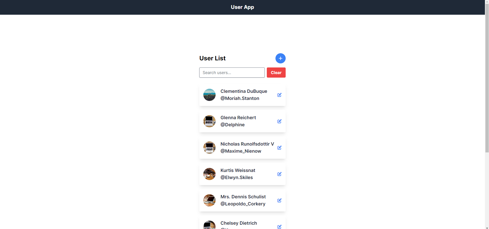
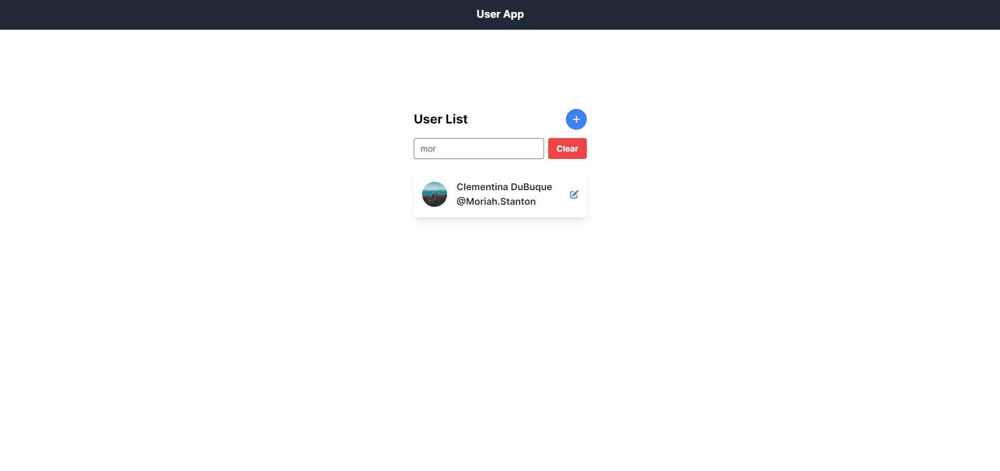
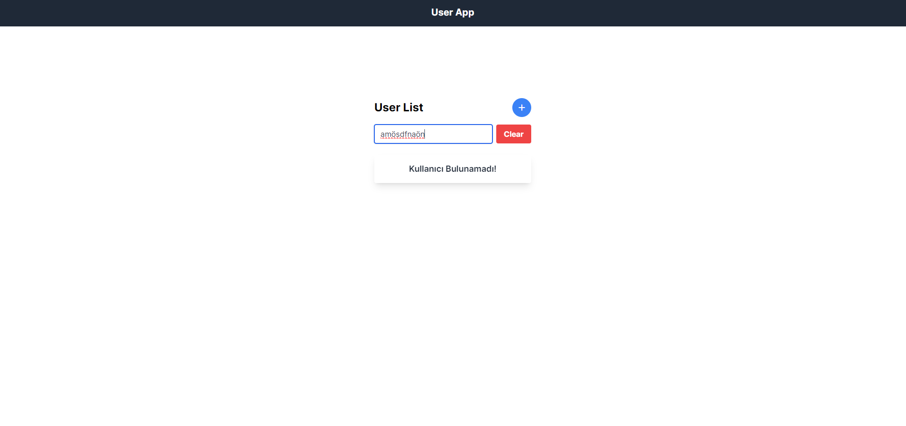
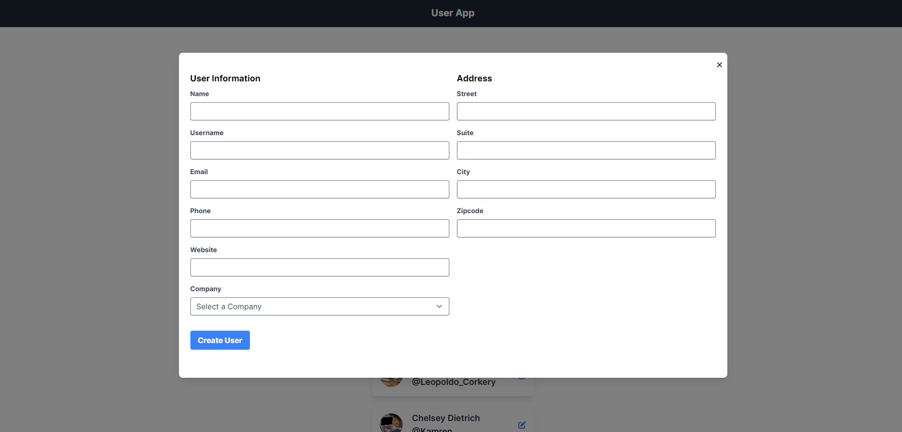
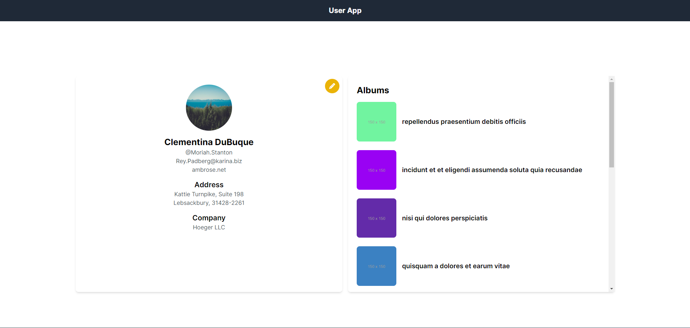
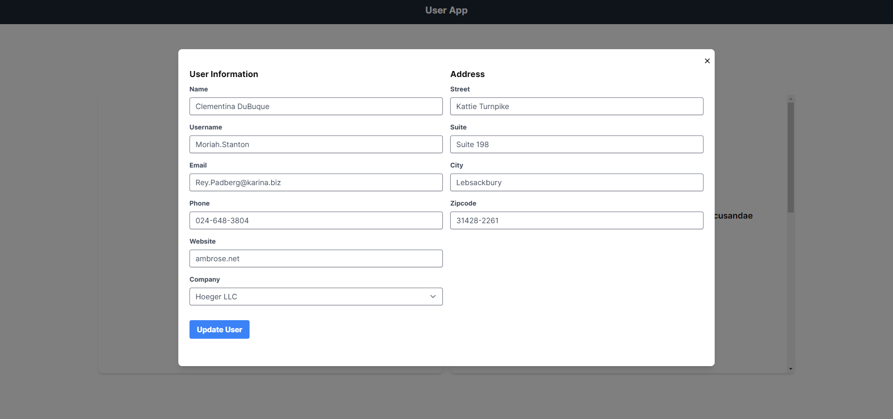
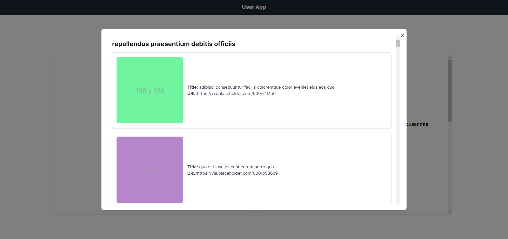

# UserApp

iWallet Ruby on Rails Final Case

## Installation

### Requirements

- Ruby 3.3.1
- Rails 7.1.3 or higher
- PostgreSQL

### Cloning the Project

First, clone the project from the GitHub repository:

```sh
git clone https://github.com/username/userapp.git

```
### Installing Dependencies

Navigate to the project directory and install the required gems:

```sh

cd userapp

bundle install
```

### Database Configuration

Before setting up the database, you need to configure the database settings. Open the config/database.yml file and update the database configuration according to your local setup. Here is an example configuration:

```yaml

default: &default
  adapter: postgresql
  encoding: unicode
  pool: 5
  username: <your_postgresql_username>
  password: <your_postgresql_password>
  host: localhost

development:
  <<: *default
  database: userapp_development

test:
  <<: *default
  database: userapp_test

production:
  <<: *default
  database: userapp_production
  username: userapp
  password: <%= ENV['USERAPP_DATABASE_PASSWORD'] %>
```

### Setting Up the Database

Create and migrate the database:

```sh
rails db:create
rails db:migrate
 ```

### Importing Data

Before running the application, you need to import data using rake tasks. Run the following commands:

```sh
rake import:users
rake import:profile_pics
rake import:album_details
 ```

### Running the Application

Start the Rails server:

```sh
rails server
 ```

## ScreenShots

# UserApp

iWallet Ruby on Rails Final Case

## Installation

### Requirements

- Ruby 3.3.1
- Rails 7.1.3 or higher
- PostgreSQL

### Cloning the Project

First, clone the project from the GitHub repository:

```sh
git clone https://github.com/username/userapp.git

```
### Installing Dependencies

Navigate to the project directory and install the required gems:

```sh

cd userapp

bundle install
```

### Database Configuration

Before setting up the database, you need to configure the database settings. Open the config/database.yml file and update the database configuration according to your local setup. Here is an example configuration:

```yaml

default: &default
  adapter: postgresql
  encoding: unicode
  pool: 5
  username: <your_postgresql_username>
  password: <your_postgresql_password>
  host: localhost

development:
  <<: *default
  database: userapp_development

test:
  <<: *default
  database: userapp_test

production:
  <<: *default
  database: userapp_production
  username: userapp
  password: <%= ENV['USERAPP_DATABASE_PASSWORD'] %>
```

### Setting Up the Database

Create and migrate the database:

```sh
rails db:create
rails db:migrate
 ```

### Importing Data

Before running the application, you need to import data using rake tasks. Run the following commands:

```sh
rake import:users
rake import:profile_pics
rake import:album_details
 ```

### Running the Application

Start the Rails server:

```sh
rails server
 ```

## ScreenShots

#### Index



#### Search



#### User Not Found



#### Create User



#### Profile



#### Edit



#### Album Details


